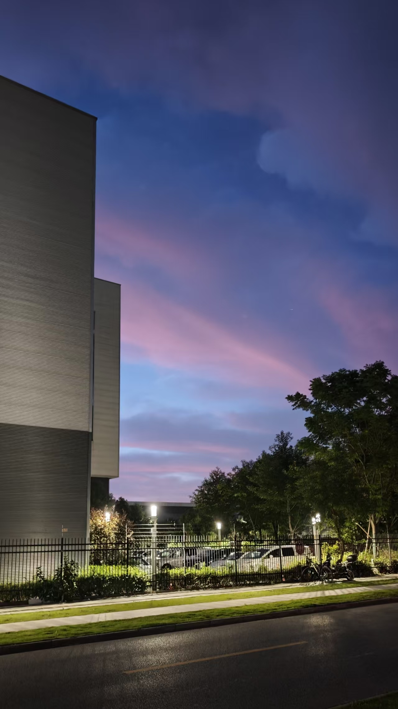
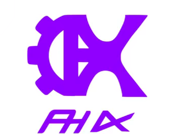

# phix 官网设计稿（DESIGN.md）

> 依据：`CONTRACT.md` §1 设计系统、§2 站点结构，以及两张素材的实读校色
> （`assets/logo-transparent.png`（透明底，全站使用）、`assets/hero-campus.jpg`）。
> 注：原始 `logo.png` 是白底截图，已弃用；favicon 由透明 logo 生成（`favicon-32.png` / `apple-touch-icon.png`）。
> 本稿只约束 `website/` 目录的 UI 表现。**所有 CSS 可直接粘贴；零外部 CDN；
> 字体用系统栈；图标一律内联 SVG；变量名与契约 §1 完全一致。**

---

## 1. 色板：实测校色后的最终 6 色

### 1.1 实测记录（我看到的）

| 来源 | 部位 | 实测近似值 | 处理结论 |
|---|---|---|---|
| logo | 齿轮 + K + PHX 字母主体 | ≈ `#9A2BE2`（亮紫、微偏洋红） | **校正** `--phix-violet`（契约原 #8B2BE2 偏暗偏蓝） |
| logo | 纯色无渐变 | — | 深紫沿用契约 `#6D28D9` 作 hover/强调，对比达标 |
| 照片 | 天顶深蓝紫 | ≈ `#4C4F8F` | 过深过蓝，**不上页面**，仅作氛围参考 |
| 照片 | 中部粉云主体 | ≈ `#D486BF`（灰玫粉） | **校正** `--phix-rose`（契约原 #F0ABFC 太浅太荧光） |
| 照片 | 云层亮部 | ≈ `#F2C4E4` | 与契约 `--phix-dusk` #E9D5FF 同族，**保留** |
| 照片 | 地平线淡紫 | ≈ `#A9B4E0` | 偏蓝，仅参考；描边保留 `#C4B5FD` |

### 1.2 最终 6 个 hex（施工以此为准）

```text
--phix-violet:  #9A2BE2   ← 校正（logo 实测）
--phix-violet-2:#6D28D9   ← 保留
--phix-lilac:   #C4B5FD   ← 保留
--phix-mist:    #F5F3FF   ← 保留
--phix-dusk:    #E9D5FF   ← 保留
--phix-rose:    #E293D6   ← 校正（照片粉云实测 #D486BF 提亮到 UI 可用）
```

正文字色、次级字色、纸白**不变**：`--ink:#1E1B2E`、`--ink-2:#5B5670`、`--paper:#FFFFFF`。

### 1.3 完整 token 块（整段粘贴到全局样式顶部）

```css
:root {
  /* —— 色板（§1 实测校正版，变量名与契约一致）—— */
  --phix-violet:  #9A2BE2;   /* logo 主紫（实测校正，原 #8B2BE2） */
  --phix-violet-2:#6D28D9;   /* 深紫：按钮 hover / 标题强调 */
  --phix-lilac:   #C4B5FD;   /* 淡紫：描边 / 次级背景 */
  --phix-mist:    #F5F3FF;   /* 极淡紫：页面底 */
  --phix-dusk:    #E9D5FF;   /* 黄昏粉紫：装饰渐变 / hero 过渡 */
  --phix-rose:    #E293D6;   /* 玫瑰粉（实测粉云校正，原 #F0ABFC） */
  --ink:          #1E1B2E;   /* 正文 */
  --ink-2:        #5B5670;   /* 次级文字 */
  --paper:        #FFFFFF;

  /* —— 形状与质感（契约 §1）—— */
  --radius-card: 16px;
  --radius-btn:  10px;
  --radius-input:10px;
  --shadow-card: 0 8px 24px rgba(154, 43, 226, .12);  /* 基于校正后 violet */
  --shadow-lift: 0 16px 40px rgba(154, 43, 226, .18);
  --font-sans: "PingFang SC", "Microsoft YaHei", -apple-system, "Segoe UI", sans-serif;
}

/* 全局基线 */
* { box-sizing: border-box; }
body {
  margin: 0;
  font-family: var(--font-sans);
  color: var(--ink);
  background: var(--phix-mist);
  line-height: 1.6;
  -webkit-font-smoothing: antialiased;
}
:where(a, button, input, select, textarea):focus-visible {
  outline: 3px solid rgba(154, 43, 226, .4);
  outline-offset: 2px;
}
```

> **给施工代理的同步提醒**：契约 §1 素材注释里 hero 遮罩写的是
> `rgba(139,43,226,.55)`（旧 violet 的 RGB）。色板校正后请改用
> `rgba(154,43,226,.55)`，下文 §2.3 的 CSS 已按新值写好，直接抄即可。

---

## 2. 首页 Hero

### 2.1 文案（定稿）

| 元素 | 文案 | 约束核对 |
|---|---|---|
| 主标题（slogan） | **把校园日常，调到黄昏频道** | 11 汉字 + 1 标点 = 12 字符 ≤ 14 ✓，且与 hero 照片的黄昏粉云直接呼应 |
| 副标题 | **来自学生社团的三个小工具：管日程、记心情、开箱即用。** | 26 字符 ≤ 30 ✓，不点名产品（产品卡就在下方） |
| 主按钮 | **产品一览**（锚点 `#products`，平滑滚动到产品卡） | — |
| 副按钮 | **下载安装包**（→ `/download/`） | — |
| 顶部小字 kicker | `PHIX 社团 · STUDENT TECH CLUB`（可选装饰） | — |

### 2.2 HTML 草图

```html
<section class="hero">
  
  <div class="hero__scrim" aria-hidden="true"></div>
  <div class="hero__content">
    <p class="hero__kicker">PHIX 社团 · STUDENT TECH CLUB</p>
    <h1 class="hero__title">把校园日常，调到黄昏频道</h1>
    <p class="hero__subtitle">来自学生社团的三个小工具：管日程、记心情、开箱即用。</p>
    <div class="hero__actions">
      <a class="btn btn--primary" href="#products">产品一览</a>
      <a class="btn btn--ghost" href="/download/">下载安装包</a>
    </div>
  </div>
</section>
```

### 2.3 完整 CSS（照片裁切 + 遮罩 + 文字，整段可粘贴）

```css
.hero {
  position: relative;
  min-height: clamp(560px, 92vh, 880px);   /* 竖图裁切后仍有足够视觉高度 */
  display: grid;
  align-items: center;
  overflow: hidden;
  isolation: isolate;
}
.hero__photo {
  position: absolute;
  inset: 0;
  width: 100%;
  height: 100%;
  object-fit: cover;               /* 竖图 1152×2048 在宽屏下取横向条带 */
  object-position: center 30%;     /* 契约指定：露出建筑边缘 + 粉云主体带 */
}
.hero__scrim {
  position: absolute;
  inset: 0;
  background:
    /* 纵向：上淡 → 下压 violet，与下方 --phix-mist 页面底自然衔接 */
    linear-gradient(180deg,
      rgba(30, 27, 46, .18) 0%,
      rgba(154, 43, 226, .40) 60%,
      rgba(154, 43, 226, .58) 100%),
    /* 横向：左侧加一层暗部，保证白字对比度 */
    linear-gradient(90deg,
      rgba(30, 27, 46, .42) 0%,
      rgba(30, 27, 46, 0) 62%);
}
.hero__content {
  position: relative;
  z-index: 1;
  width: 100%;
  max-width: 1200px;
  margin: 0 auto;
  padding: 96px 24px;
}
.hero__kicker {
  margin: 0;
  font-size: 13px;
  font-weight: 600;
  letter-spacing: .18em;
  color: rgba(255, 255, 255, .75);
}
.hero__title {
  margin: 12px 0 0;
  font-size: clamp(2.5rem, 6.5vw, 4.75rem);
  line-height: 1.12;
  font-weight: 800;
  letter-spacing: -0.02em;
  color: #fff;
  max-width: 18ch;
  text-wrap: balance;
}
.hero__subtitle {
  margin: 20px 0 0;
  font-size: clamp(1rem, 1.6vw, 1.25rem);
  line-height: 1.75;
  color: rgba(255, 255, 255, .88);
  max-width: 34em;
}
.hero__actions {
  margin-top: 36px;
  display: flex;
  flex-wrap: wrap;
  gap: 14px;
}
```

### 2.4 字号 / 行高 / 字重规格表

| 元素 | 字号 | 行高 | 字重 | 备注 |
|---|---|---|---|---|
| hero 主标题 | `clamp(40px, 6.5vw, 76px)` | 1.12 | 800 | 字距 -0.02em，纯白 |
| hero 副标题 | `clamp(16px, 1.6vw, 20px)` | 1.75 | 400 | 白 88%，最大宽 34em |
| kicker | 13px | 1 | 600 | 字距 .18em，白 75% |
| 按钮 | 16px | 1 | 600 | 高 48px，圆角 `--radius-btn` |

### 2.5 按钮组件（hero 与全站通用）

```css
.btn {
  display: inline-flex;
  align-items: center;
  justify-content: center;
  gap: 8px;
  height: 48px;
  padding: 0 28px;
  border: 0;
  border-radius: var(--radius-btn);
  font-size: 1rem;
  font-weight: 600;
  line-height: 1;
  text-decoration: none;
  transition: background-color .2s ease, border-color .2s ease, transform .2s ease;
}
.btn:active { transform: translateY(1px); }
.btn--primary { background: var(--phix-violet); color: #fff; }
.btn--primary:hover { background: var(--phix-violet-2); }
.btn--ghost {
  border: 1px solid rgba(255, 255, 255, .65);
  color: #fff;
  background: rgba(255, 255, 255, .06);
}
.btn--ghost:hover { background: rgba(255, 255, 255, .16); border-color: #fff; }
.btn--sm { height: 38px; padding: 0 18px; font-size: .875rem; }
```

小屏（≤640px）：`hero__actions` 已可换行；标题自动缩到 40px 下限，无需额外断点。

---

## 3. 顶栏 + 「产品」下拉菜单

### 3.1 HTML 草图

```html
<header class="site-header">
  <div class="site-header__inner">
    <a class="brand" href="/" aria-label="phix 首页">
         <!-- 高度固定 34px -->
    </a>

    <nav class="nav" aria-label="主导航">
      <ul class="nav__list">
        <li><a class="nav__link" href="/about/">关于我们</a></li>
        <li class="nav__item">
          <a class="nav__link nav__link--toggle" href="#products"
             aria-haspopup="true" aria-expanded="false">
            产品
            <svg class="nav__chevron" width="14" height="14" viewBox="0 0 24 24"
                 fill="none" stroke="currentColor" stroke-width="2.5"
                 stroke-linecap="round" stroke-linejoin="round" aria-hidden="true">
              <polyline points="6 9 12 15 18 9"/>
            </svg>
          </a>
          <div class="dropdown">
            <p class="dropdown__group">软件</p>
            <a class="dropdown__item" href="/products/xinlv/">
              <svg width="18" height="18" viewBox="0 0 24 24" fill="none"
                   stroke="currentColor" stroke-width="2" stroke-linecap="round"
                   stroke-linejoin="round" aria-hidden="true"><path d="M20.84 4.61a5.5 5.5 0 0 0-7.78 0L12 5.67l-1.06-1.06a5.5 5.5 0 0 0-7.78 7.78l1.06 1.06L12 21.23l7.78-7.78 1.06-1.06a5.5 5.5 0 0 0 0-7.78z"/></svg>
              <span>心履<small>心情记录 · 网页与客户端</small></span>
            </a>
            <a class="dropdown__item" href="/products/phl/">
              <svg width="18" height="18" viewBox="0 0 24 24" fill="none"
                   stroke="currentColor" stroke-width="2" stroke-linecap="round"
                   stroke-linejoin="round" aria-hidden="true"><rect x="3" y="4" width="18" height="18" rx="2"/><line x1="16" y1="2" x2="16" y2="6"/><line x1="8" y1="2" x2="8" y2="6"/><line x1="3" y1="10" x2="21" y2="10"/></svg>
              <span>PHL<small>日程与校园信息中枢</small></span>
            </a>
            <p class="dropdown__group">硬件</p>
            <span class="dropdown__item dropdown__item--disabled" aria-disabled="true">
              <svg width="18" height="18" viewBox="0 0 24 24" fill="none"
                   stroke="currentColor" stroke-width="2" stroke-linecap="round"
                   stroke-linejoin="round" aria-hidden="true"><rect x="4" y="4" width="16" height="16" rx="2"/><rect x="9" y="9" width="6" height="6"/></svg>
              <span>敬请期待</span>
            </span>
          </div>
        </li>
        <li><a class="nav__link" href="/docs/">文档</a></li>
      </ul>
    </nav>

    <div class="site-header__actions">
      <a class="nav__link" href="/support/">服务与支持</a>
      <a class="nav__link" href="/download/">下载</a>
      <!-- 未登录： -->
      <a class="btn btn--sm btn--primary" href="/login/">登录 / 注册</a>
      <!-- 已登录：替换为头像按钮 + 同款 .dropdown（右对齐）：
           个人中心 / 退出登录 -->
    </div>
  </div>
</header>
```

> PHL Lite 不进下拉（契约 §2 只列硬件/心履/PHL）；入口放在首页产品卡，CTA 指向下载页。

### 3.2 CSS（sticky / hover / 下拉动画，整段可粘贴）

```css
.site-header {
  position: sticky;
  top: 0;
  z-index: 50;
  background: rgba(255, 255, 255, .92);
  backdrop-filter: blur(12px);          /* 毛玻璃，零依赖 */
  border-bottom: 1px solid var(--phix-lilac);
}
.site-header__inner {
  max-width: 1200px;
  margin: 0 auto;
  padding: 0 24px;
  height: 64px;
  display: flex;
  align-items: center;
  gap: 32px;
}
.brand { display: inline-flex; }
.brand img { height: 34px; width: auto; display: block; }

.nav__list {
  display: flex;
  align-items: center;
  gap: 4px;
  list-style: none;
  margin: 0;
  padding: 0;
}
.nav__link {
  display: inline-flex;
  align-items: center;
  gap: 4px;
  padding: 8px 14px;
  border-radius: var(--radius-btn);
  color: var(--ink);
  font-size: 15px;
  text-decoration: none;
  transition: background-color .18s ease, color .18s ease;
}
.nav__link:hover { background: var(--phix-mist); color: var(--phix-violet-2); }
.site-header__actions {
  margin-left: auto;
  display: flex;
  align-items: center;
  gap: 6px;
}
.nav__chevron { transition: transform .18s ease; }
.nav__item:hover .nav__chevron,
.nav__item:focus-within .nav__chevron { transform: rotate(180deg); }

/* —— 下拉菜单 —— */
.nav__item { position: relative; }
.dropdown {
  position: absolute;
  top: 100%;
  left: 0;
  min-width: 240px;
  padding: 8px;
  background: var(--paper);
  border: 1px solid var(--phix-lilac);
  border-radius: var(--radius-card);
  box-shadow: var(--shadow-card);
  opacity: 0;
  visibility: hidden;
  transform: translateY(8px);
  transition: opacity .18s ease, transform .18s ease, visibility .18s;
}
/* 悬停桥：填住菜单与触发器之间的 8px 空隙，防止鼠标移动时闪烁 */
.dropdown::before {
  content: "";
  position: absolute;
  top: -10px;
  left: 0;
  right: 0;
  height: 10px;
}
.nav__item:hover .dropdown,
.nav__item:focus-within .dropdown {
  opacity: 1;
  visibility: visible;
  transform: translateY(4px);
}
.dropdown__group {
  margin: 8px 10px 4px;
  font-size: 12px;
  font-weight: 600;
  letter-spacing: .12em;
  color: var(--ink-2);
}
.dropdown__item {
  display: flex;
  align-items: center;
  gap: 10px;
  padding: 10px;
  border-radius: var(--radius-btn);
  color: var(--ink);
  font-size: 14px;
  font-weight: 500;
  text-decoration: none;
}
.dropdown__item svg { color: var(--phix-violet); flex: none; }
.dropdown__item span { display: flex; flex-direction: column; }
.dropdown__item small { color: var(--ink-2); font-size: 12px; font-weight: 400; }
a.dropdown__item:hover { background: var(--phix-mist); color: var(--phix-violet-2); }
.dropdown__item--disabled {
  color: var(--ink-2);
  opacity: .55;
  cursor: not-allowed;
}
.dropdown__item--disabled svg { color: var(--ink-2); }
```

交互细节：
- 键盘可达：`focus-within` 与 hover 同效，Tab 进触发器即展开。
- 动画为 `opacity + translateY(8px→4px)`，180ms ease；`visibility` 一并过渡，避免隐藏态仍吃点击。
- 头像下拉复用 `.dropdown`，追加 `left: auto; right: 0;` 即可右对齐。
- ≤860px：隐藏 `.nav` 与左侧 actions，显示汉堡按钮（点按展开全宽面板，
  需一小段 JS 切 class，实现自由，本稿不限定写法）。

---

## 4. 三个产品卡（心履 / PHL / PHL Lite）

### 4.1 HTML 草图（以心履为例，其余同构）

```html
<section class="products" id="products">
  <h2 class="products__title reveal">三个产品，一种生活节奏</h2>
  <div class="products__grid">

    <article class="product-card reveal">
      <span class="product-card__icon" aria-hidden="true">
        <svg width="22" height="22" viewBox="0 0 24 24" fill="none" stroke="currentColor"
             stroke-width="2" stroke-linecap="round" stroke-linejoin="round"><path d="M20.84 4.61a5.5 5.5 0 0 0-7.78 0L12 5.67l-1.06-1.06a5.5 5.5 0 0 0-7.78 7.78l1.06 1.06L12 21.23l7.78-7.78 1.06-1.06a5.5 5.5 0 0 0 0-7.78z"/></svg>
      </span>
      <h3 class="product-card__name">心履 <span class="product-card__tag">心情记录</span></h3>
      <p class="product-card__desc">每天一句话，把情绪轻轻放下——你的随身心情手账。</p>
      <a class="product-card__cta" href="/products/xinlv/">了解更多 →</a>
    </article>

    <article class="product-card reveal">
      <!-- 图标：calendar（rect+3 条 line，见 §3.1） -->
      <h3 class="product-card__name">PHL <span class="product-card__tag">效率中枢</span></h3>
      <p class="product-card__desc">课表、作业、邮箱一屏管完，校园信息不再散落各处。</p>
      <a class="product-card__cta" href="/products/phl/">了解更多 →</a>
    </article>

    <article class="product-card reveal">
      <!-- 图标：zap，path d="M13 2 3 14h9l-1 8 10-12h-9l1-8z" -->
      <h3 class="product-card__name">PHL Lite <span class="product-card__tag">轻量版</span></h3>
      <p class="product-card__desc">轻到几乎无感的日程助手，低配电脑也能秒开。</p>
      <a class="product-card__cta" href="/download/">免费下载 →</a>
    </article>

  </div>
</section>
```

### 4.2 卖点文案定稿（各一句）

| 产品 | 一句卖点 | CTA |
|---|---|---|
| 心履 | 每天一句话，把情绪轻轻放下——你的随身心情手账。 | `/products/xinlv/` |
| PHL | 课表、作业、邮箱一屏管完，校园信息不再散落各处。 | `/products/phl/` |
| PHL Lite | 轻到几乎无感的日程助手，低配电脑也能秒开。 | `/download/`（下载页列 phllite 安装包；站点无独立介绍页，故不指向不存在的路由） |

### 4.3 CSS

```css
.products {
  max-width: 1200px;
  margin: 0 auto;
  padding: 96px 24px;
}
.products__title {
  margin: 0 0 48px;
  text-align: center;
  font-size: clamp(1.75rem, 3vw, 2.5rem);
  line-height: 1.2;
  font-weight: 800;
  letter-spacing: -0.02em;
  color: var(--ink);
}
.products__grid {
  display: grid;
  grid-template-columns: repeat(3, 1fr);
  gap: 24px;
}
.product-card {
  position: relative;
  overflow: hidden;
  display: flex;
  flex-direction: column;
  gap: 12px;
  padding: 28px;
  background: var(--paper);
  border: 1px solid var(--phix-lilac);
  border-radius: var(--radius-card);
  box-shadow: var(--shadow-card);
  transition: transform .25s ease, box-shadow .25s ease;
}
/* 顶部渐变细条：hover 时点亮 */
.product-card::before {
  content: "";
  position: absolute;
  inset: 0 0 auto 0;
  height: 4px;
  background: linear-gradient(90deg, var(--phix-violet), var(--phix-rose));
  opacity: 0;
  transition: opacity .25s ease;
}
.product-card:hover {
  transform: translateY(-4px);
  box-shadow: var(--shadow-lift);
}
.product-card:hover::before { opacity: 1; }

.product-card__icon {
  display: inline-flex;
  align-items: center;
  justify-content: center;
  width: 44px;
  height: 44px;
  border-radius: 12px;
  background: var(--phix-mist);
  border: 1px solid var(--phix-lilac);
  color: var(--phix-violet);
}
.product-card__name {
  margin: 4px 0 0;
  font-size: 1.25rem;
  font-weight: 700;
  color: var(--ink);
  display: flex;
  align-items: center;
  gap: 10px;
}
.product-card__tag {
  padding: 2px 10px;
  border-radius: 999px;
  background: var(--phix-mist);
  border: 1px solid var(--phix-lilac);
  color: var(--phix-violet-2);
  font-size: 12px;
  font-weight: 500;
}
.product-card__desc {
  margin: 0;
  color: var(--ink-2);
  font-size: .9375rem;
  line-height: 1.7;
  flex: 1;
}
.product-card__cta {
  margin-top: 4px;
  color: var(--phix-violet);
  font-size: .9375rem;
  font-weight: 600;
  text-decoration: none;
}
.product-card__cta:hover { color: var(--phix-violet-2); text-decoration: underline; }

@media (max-width: 900px) { .products__grid { grid-template-columns: 1fr; max-width: 440px; margin: 0 auto; } }
```

---

## 5. 页脚

### 5.1 HTML 结构

```html
<footer class="site-footer">
  <div class="site-footer__inner">
    <div class="site-footer__col">
      
      <p class="site-footer__blurb">学生技术社团 · 用代码装点校园生活</p>
    </div>
    <nav class="site-footer__links" aria-label="页脚导航">
      <a href="/about/">关于我们</a>
      <a href="/products/xinlv/">产品</a>
      <a href="/download/">下载</a>
    </nav>
  </div>
  <div class="site-footer__copy">© 2026 phix 社团 · 仅用于学习交流</div>
</footer>
```

> 铁律自查：页脚只有社团名与通用链接，**无任何真实姓名/学号/邮箱**。

### 5.2 CSS

```css
.site-footer {
  margin-top: 0;
  padding: 56px 24px 0;
  background: var(--ink);
  color: rgba(255, 255, 255, .72);
}
.site-footer__inner {
  max-width: 1200px;
  margin: 0 auto;
  display: flex;
  flex-wrap: wrap;
  gap: 32px;
  align-items: flex-start;
  justify-content: space-between;
}
.site-footer__logo { height: 28px; width: auto; }
.site-footer__blurb { margin: 12px 0 0; font-size: .875rem; }
.site-footer__links { display: flex; gap: 28px; }
.site-footer__links a {
  color: var(--phix-lilac);
  font-size: .9375rem;
  text-decoration: none;
}
.site-footer__links a:hover { color: #fff; text-decoration: underline; }
.site-footer__copy {
  max-width: 1200px;
  margin: 40px auto 0;
  padding: 20px 0 24px;
  border-top: 1px solid rgba(196, 181, 253, .18);
  font-size: .8125rem;
  color: rgba(255, 255, 255, .5);
}
```

---

## 6. 滚动渐显（IntersectionObserver，零依赖）

### 6.1 CSS

```css
.reveal {
  opacity: 0;
  transform: translateY(24px);
  transition: opacity .6s ease, transform .6s cubic-bezier(.22, .61, .36, 1);
  transition-delay: var(--reveal-delay, 0ms);
}
.reveal.is-visible { opacity: 1; transform: none; }
@media (prefers-reduced-motion: reduce) {
  .reveal { opacity: 1; transform: none; transition: none; }
}
```

### 6.2 JS（恰好 10 行，vanilla，无外部依赖）

```js
const revealEls = document.querySelectorAll('.reveal');
const io = new IntersectionObserver((entries) => {
  for (const entry of entries) {
    if (!entry.isIntersecting) continue;
    entry.target.classList.add('is-visible');
    io.unobserve(entry.target);            // 只播放一次，滚回不闪
  }
}, { threshold: 0.15, rootMargin: '0px 0px -8% 0px' });
revealEls.forEach((el, i) => el.style.setProperty('--reveal-delay', `${(i % 3) * 80}ms`));
revealEls.forEach((el) => io.observe(el));
```

用法：给需要渐显的元素加 `class="reveal"`（章节标题、产品卡、页脚上方内容）。
同排元素靠 `--reveal-delay` 依序错开 80ms（每 3 个一循环）；`prefers-reduced-motion`
用户在 CSS 层直接显示，JS 无需判断。

---

## 7. 登录/注册页 与 个人中心 tab 布局

### 7.1 登录 / 注册：单栏居中

```text
┌────────── 全屏 --phix-mist 底，垂直水平居中 ──────────┐
│        ┌── 卡片 width:min(400px, 100%) ─────────┐     │
│        │   [logo 34px]            ← 居中         │     │
│        │   欢迎回来      24px / 800 / --ink      │     │
│        │   登录你的 phix 账号  14px / --ink-2     │     │
│        │   （上方 24px）                          │     │
│        │   用户名                                 │     │
│        │   [__________________]  ← 输入框规格见下 │     │
│        │   （行距 16px）密码                       │     │
│        │   [__________________]                  │     │
│        │   [       登 录        ] ← 主按钮 全宽   │     │
│        │   （上方 20px，居中 13px）                │     │
│        │   还没有账号？ 去注册  ← 链接 --phix-violet│     │
│        └─────────────────────────────────────────┘     │
│   注册页同构：宽 420px，字段为 用户名/密码/确认密码       │
│   登录成功 → 回跳 ?next=；入口按钮组垂直 gap 16px         │
└─────────────────────────────────────────────────────────┘
```

```css
.auth-page {
  min-height: calc(100vh - 64px);
  display: grid;
  place-items: center;
  padding: 48px 24px;
  background: var(--phix-mist);
}
.auth-card {
  width: min(400px, 100%);
  padding: 40px 32px;
  background: var(--paper);
  border: 1px solid var(--phix-lilac);
  border-radius: var(--radius-card);
  box-shadow: var(--shadow-card);
  text-align: center;
}
.auth-card__logo { height: 34px; width: auto; }
.auth-card__title { margin: 16px 0 0; font-size: 1.5rem; font-weight: 800; color: var(--ink); }
.auth-card__hint  { margin: 6px 0 24px; font-size: .875rem; color: var(--ink-2); }
.auth-card form { display: flex; flex-direction: column; gap: 16px; text-align: left; }
.auth-card .btn--primary { width: 100%; margin-top: 4px; }
.auth-card__switch { margin-top: 20px; font-size: 13px; color: var(--ink-2); }
.auth-card__switch a { color: var(--phix-violet); font-weight: 600; text-decoration: none; }
.auth-card__switch a:hover { color: var(--phix-violet-2); text-decoration: underline; }

/* 表单控件（登录/注册/个人中心通用） */
.field { display: flex; flex-direction: column; gap: 6px; }
.field label { font-size: 14px; font-weight: 600; color: var(--ink); }
.field input, .field select, .field textarea {
  height: 44px;
  padding: 0 14px;
  border: 1px solid var(--phix-lilac);
  border-radius: var(--radius-input);
  background: var(--paper);
  color: var(--ink);
  font: inherit;
  transition: border-color .18s ease, box-shadow .18s ease;
}
.field textarea { height: auto; min-height: 88px; padding: 12px 14px; resize: vertical; }
.field input:focus, .field select:focus, .field textarea:focus {
  outline: none;
  border-color: var(--phix-violet);
  box-shadow: 0 0 0 3px rgba(154, 43, 226, .16);
}
.field__help { font-size: 12px; color: var(--ink-2); }
```

注册页只改：`.auth-card { width: min(420px, 100%); }`、标题「创建账号」、字段多一组确认密码。

### 7.2 个人中心 `/account/`：两栏（左 tab · 右面板）

```text
┌ 顶栏 64px（sticky）──────────────────────────────────────┐
│  内容区 max-width 1080px · padding 32px 24px              │
│  ┌─ 左栏 220px ─────┐  ┌─ 右栏 flex:1 · min-width:0 ──┐  │
│  │ [头像 64px 圆形]  │  │  个人信息        20px / 700   │  │
│  │ 用户名 16px/600   │  │  （下方 20px）                │  │
│  │ ───── 16px ─────  │  │  ┌ 白卡 padding 28px ─────┐  │  │
│  │ ▌个人信息  ← 激活 │  │  │ 用户名（只读 + 帮助文字：│  │  │
│  │   心情记录        │  │  │ 「用户名不可改」）        │  │  │
│  │   日程            │  │  │ 行距 20px                │  │  │
│  │   密码管理        │  │  │ 头像：圆形预览 72px +    │  │  │
│  │                   │  │  │ 「更换头像」幽灵按钮      │  │  │
│  │  (sticky top 96)  │  │  │ 行距 20px                │  │  │
│  │                   │  │  │ 修改密码：旧密码/新密码   │  │  │
│  │                   │  │  │ （拿不到 DEK 时此处显示   │  │  │
│  │                   │  │  │ 「请到客户端修改」提示）  │  │  │
│  │                   │  │  └─────────────────────────┘  │  │
│  └───────────────────┘  └───────────────────────────────┘  │
│   两栏 gap 24px；移动端左栏变为顶部横滑 chips（见下）        │
└─────────────────────────────────────────────────────────────┘
```

```css
.account {
  max-width: 1080px;
  margin: 0 auto;
  padding: 32px 24px 64px;
  display: grid;
  grid-template-columns: 220px minmax(0, 1fr);
  gap: 24px;
  align-items: start;
}
.account__side {
  position: sticky;
  top: 96px;                 /* 顶栏 64 + 32 呼吸 */
  display: flex;
  flex-direction: column;
  gap: 4px;
  padding: 16px;
  background: var(--paper);
  border: 1px solid var(--phix-lilac);
  border-radius: var(--radius-card);
  box-shadow: var(--shadow-card);
}
.account__avatar {
  width: 64px; height: 64px;
  border-radius: 50%;
  object-fit: cover;
  border: 2px solid var(--phix-lilac);
}
.account__user { margin: 10px 0 14px; font-size: 1rem; font-weight: 600; color: var(--ink); }
.account__tab {
  display: flex;
  align-items: center;
  gap: 8px;
  padding: 10px 14px;
  border-radius: var(--radius-btn);
  border-left: 3px solid transparent;
  color: var(--ink-2);
  font-size: .9375rem;
  font-weight: 500;
  text-decoration: none;
}
.account__tab:hover { background: var(--phix-mist); color: var(--phix-violet-2); }
.account__tab.is-active {
  background: var(--phix-mist);
  border-left-color: var(--phix-violet);
  color: var(--phix-violet-2);
  font-weight: 600;
}
.account__main { min-width: 0; }
.account__title { margin: 0 0 20px; font-size: 1.25rem; font-weight: 700; color: var(--ink); }
.account__panel {
  padding: 28px;
  background: var(--paper);
  border: 1px solid var(--phix-lilac);
  border-radius: var(--radius-card);
  box-shadow: var(--shadow-card);
}
.account__panel form { display: flex; flex-direction: column; gap: 20px; max-width: 480px; }

@media (max-width: 860px) {
  .account { grid-template-columns: 1fr; }
  .account__side {
    position: static;
    flex-direction: row;
    overflow-x: auto;                 /* tab 变横滑 chips */
    align-items: center;
  }
  .account__avatar { width: 40px; height: 40px; }
  .account__user { margin: 0 8px 0 4px; white-space: nowrap; }
  .account__tab { border-left: 0; border-bottom: 3px solid transparent; white-space: nowrap; }
  .account__tab.is-active { border-bottom-color: var(--phix-violet); }
}
```

### 7.3 其余三个 tab 的布局要点（结构同 `.account__panel`）

| Tab | 布局要点 |
|---|---|
| 心情记录 | 顶部：textarea 发表框（文本 + 1–5 强度圆点选择 + 发布按钮）；下方：条目卡片流（gap 12px），每条 = 时间戳（12px `--ink-2`）+ 文本 + 强度点（5 个 8px 圆点，点亮数=强度，色 `--phix-violet`）+ 右上角删除图标按钮。写 `mood` 对象 |
| 日程 | 按 day 分组的简单列表（组标题 13px/600 `--ink-2`）；每行 = time（等宽感 14px/600）+ title + note（13px `--ink-2`）+ 删除（只删自己 created 的）；顶部「新增」按钮展开一行表单：day / time / title / note 四控件横排（移动端纵排） |
| 密码管理 | 平台行列表：平台名 + 账号 + 密码列（`●●●●●●●●` 打码 + 眼睛图标切换显示，eye 图标：`<path d="M1 12s4-8 11-8 11 8 11 8-4 8-11 8-11-8-11-8z"/><circle cx="12" cy="12" r="3"/>`）+ 编辑按钮；提交即加密上传，页面明文不留存；行间用 1px `--phix-lilac` 分隔线 |

---

## 8. 施工自查清单（对照契约 §8 UI 检查）

- [ ] 色板用 §1.3 token 块，6 色与 §1.2 一致；**不出现** `#8B2BE2` / `#F0ABFC` 旧值
- [ ] hero：`object-fit:cover; object-position:center 30%`，遮罩用 §2.3 双渐变
- [ ] 顶栏 sticky + 白底 + 1px `--phix-lilac` 底边；logo 高 34px；点击回首页
- [ ] 下拉：硬件项置灰标「敬请期待」；键盘 focus-within 可展开
- [ ] 产品卡三张，圆角 16px、阴影 `--shadow-card`；PHL Lite CTA → `/download/`
- [ ] 页脚：社团名 + 版权行 + 三个快速链接，**无任何真实个人信息**
- [ ] 渐显 JS 恰好 10 行；`prefers-reduced-motion` 有 CSS 回退
- [ ] 登录/注册单栏居中（400/420px）；个人中心两栏（220px + flex），≤860px 降级
- [ ] 全站零外部 CDN：字体系统栈、图标内联 SVG、无任何 `<link href="http…">`
